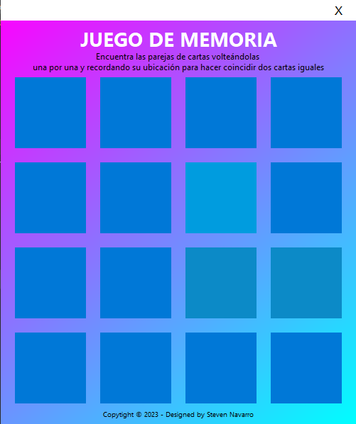
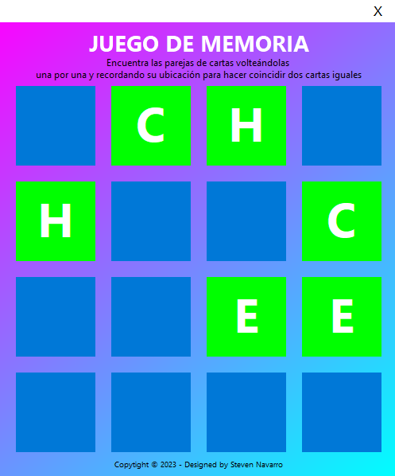

# Juego Memoria - Java

Juego de memoria desarrollado en Java con la interfaz gráfica Java Swing. El objetivo del juego es voltear cartas con letras de la A a la H y encontrar las coincidencias.

## Requisitos previos

Antes de ejecutar el proyecto, asegúrate de tener instalado lo siguiente:
1. JDK 14 o superior (Java Development Kit)
2. IntelliJ IDEA

## Capturas de pantalla

A continuación, se muestran algunas capturas de pantalla del funcionamiento del proyecto

1. Vista inicial del juego:
	
 

2. Vista del desarrollo del juego:
	
 
